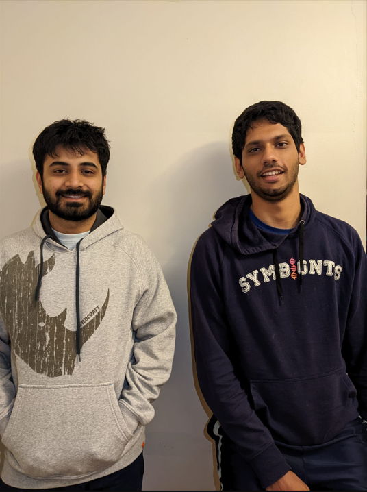
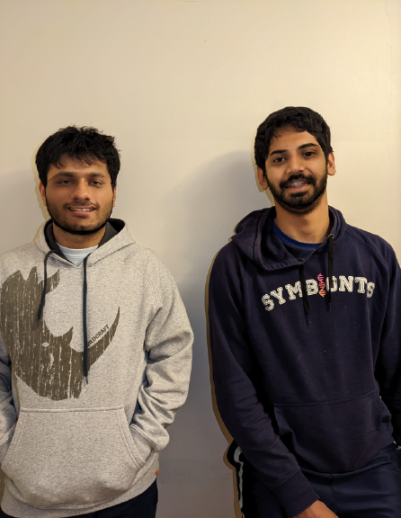
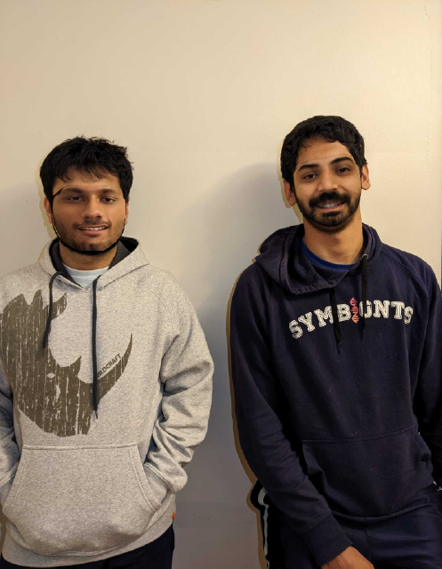

# DeepFakes: Warping and Swapping Faces

The code can be found in the `Code` folder.
The Data files can be found in the `Data` folder. 
The input to both the models is a picture of us (Shounak and Me) and is given below.

1) To run the Delaunay triangulation:

Run `python3 Wrapper.py`

To change the image input, put the image path into the first line of the `doAll()` function.
Running the above command will cause a pop-up which displays the final FaceSwap image.

The results of Face swap done by Triangulation method is shown below

1) To run the Thin Plate Spline:

Run `python3 Wrapper_tps.py`

The results of Face swap done by Thin Plate Spline method is shown below:

To change the image input, put the image path into the first line of the `doAll()` function.
Running the above command will cause a pop-up which displays the final FaceSwap image.

